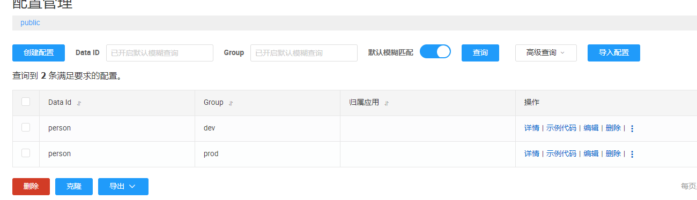

# Spring Cloud集成nacos example
## 1. 安装nacos
去[nacos官网](https://nacos.io/zh-cn/docs/v2/quickstart/quick-start.html)安装最新版。  

高版本nacos需要修改配置文件.`nacos/conf/application.properties`
```properties
nacos.core.auth.plugin.nacos.token.secret.key=SecretKey012345678901234567890123456789012345678901234567890123456789
```

单机模式启动
```shell
startup.cmd -m standalone
```

## 2. 使用nacos作为配置中心
### 引入依赖 
```xml
<dependency>
    <groupId>com.alibaba.cloud</groupId>
    <artifactId>spring-cloud-starter-alibaba-nacos-config</artifactId>
</dependency>
```
高版本的SpringCloud的不再需要`bootstrap.properties`。所有的配置都写在`application.properties/yaml`
```yaml
spring:
  cloud:
    nacos:
      config:
        server-addr: localhost:8848
        file-extension: yaml
        group: dev
        username: nacos
        password: nacos
  config:
    import:
#       拉取nacos配置：dataId=person, group=dev
      - nacos:person?group=dev
```
### spring.config.import
上面使用了`spring.config.import`，可以通过导入配置文件的方式加载配置参数
- 导入`classpath`上的配置文件
```yaml
spring:
  config:
    import:
    # 导入classpath下default目录下的default.properties配置文件
    - classpath:/default/default.properties
    # 导入classpath下service目录下的service.yml配置文件
    - classpath:/service/service.yml
```

- 导入系统目录下的配置文件
```yaml
spring:
  config:
    import:
    # 导入系统目录/Users/yuqiyu/Downloads下的system.properties配置文件
    - optional:/Users/yuqiyu/Downloads/system.properties
```

- 导入nacos里的配置文件
```yaml
spring:
  cloud:
    nacos:
      server-addr: localhost:8848
  config:
    import:
      # 导入nacos配置中心的配置文件
      - optional:nacos:spring-config-import-example.yaml
```
- Optional选项  
在路径前加上`Optional`，允许导入的配置文件不存在。当没有optional时，如果配置文件不存在会报错
```yaml
spring:
  config:
    import:
      # 不存在会报错
      - classpath:dog.yaml
      # 允许不存在
      - optional:classpath:cat.yaml
```
## nacos创建配置文件

dev的配置文件
```yaml
person:
    name:
        yanghuadong
```
prod的配置文件
```yaml
person:
    name:
        bikala-bikala
    age:
        29
```

## 4. 运行
### 在dev环境启动
```yaml
spring:
  profiles:
    active: dev

---
spring:
  config:
    activate:
      on-profile: dev
    import:
      # 拉取nacos配置：傳入dataId
      - nacos:person?group=dev
      - classpath:dog.yaml
      - optional:classpath:cat.yaml
```
输出:`user name :yanghuadong; age: null`

### 在prod环境启动
```yaml
spring:
  profiles:
    active: prod
    
---
spring:
  config:
    import:
      # 拉取nacos配置：傳入dataId
      - nacos:person?group=prod
    activate:
      on-profile: prod
```
输出:`user name :bikala-bikala; age: 29`